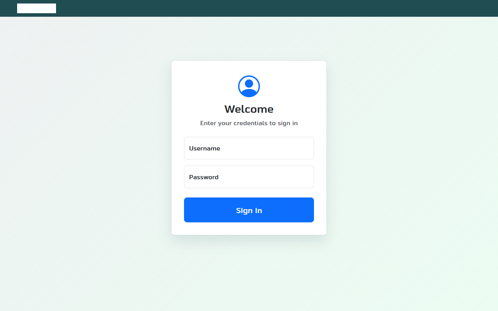

# FSP Attendance Clock

[](LICENSE)
[](https://dotnet.microsoft.com/download/dotnet/9)
[](https://www.postgresql.org/)
[](https://github.com/FSP-Labs/FSP.AttendanceClock/issues)

A clean, self-hosted employee attendance system. Employees clock in and out; administrators manage users, view audit logs, and export hour reports.



---

## Features

| Employees | Administrators |
|-----------|---------------|
| Clock in / clock out | Manage users (create, delete, reset password) |
| View personal attendance history | View all attendance records |
| Filter records by date range | Full audit log (all system actions) |
| Edit records with reason + audit trail | Export hours report to Excel |
| Change password | Configurable ordinary / extra hours threshold |

---

## Tech Stack

- **Backend:** ASP.NET Core 9 MVC, Entity Framework Core 9
- **Database:** PostgreSQL 14+
- **Frontend:** Bootstrap 5, Bootstrap Icons
- **Auth:** Cookie-based authentication, PBKDF2 password hashing
- **Reports:** ClosedXML (Excel export)

---

## Quick Start

**Prerequisites:** [.NET 9 SDK](https://dotnet.microsoft.com/download/dotnet/9) and PostgreSQL 14+.

```bash
# 1. Clone the repo
git clone https://github.com/FSP-Labs/FSP.AttendanceClock.git
cd FSP.AttendanceClock

# 2. Configure the connection string
cp FSP.AttendanceClock.Web/appsettings.Example.json FSP.AttendanceClock.Web/appsettings.json
# Edit appsettings.json and set your PostgreSQL connection string

# 3. Apply database migrations
dotnet ef database update \
  --project FSP.AttendanceClock.Infrastructure \
  --startup-project FSP.AttendanceClock.Web

# 4. Run the app
dotnet run --project FSP.AttendanceClock.Web
```

The app starts at `https://localhost:7294`. Default admin credentials are set via `appsettings.json` (`AdminSettings:InitialPassword`) — the seeder creates an `admin` user on first run.

> **Note:** Read [`SECURITY_REVIEW_X_FORWARDED_FOR.md`](SECURITY_REVIEW_X_FORWARDED_FOR.md) before deploying behind a reverse proxy.

---

## Architecture

Three-layer clean architecture across three projects:

- **`FSP.AttendanceClock.Core`** — Domain entities (`User`, `Attendance`, `SystemLog`) and interfaces. No dependencies.
- **`FSP.AttendanceClock.Infrastructure`** — EF Core `AppDbContext`, migrations, `AuditService`, `LoginAttemptService` (brute-force protection), `PasswordHasher` (PBKDF2), `AttendanceReportService`.
- **`FSP.AttendanceClock.Web`** — ASP.NET Core MVC: controllers, Razor views, ViewModels, middleware, and configuration.

Database tables: `Usuarios`, `Fichajes`, `AuditoriasFichajes`, `RegistrosSistema`.

---

## Custom Logo

Replace `FSP.AttendanceClock.Web/wwwroot/img/logo.png` with your own logo. The current file is a white placeholder (200×50 px).

---

## Contributing

Contributions are welcome! See [CONTRIBUTING.md](CONTRIBUTING.md) for guidelines. Looking for a place to start? Check the [good first issues](https://github.com/FSP-Labs/FSP.AttendanceClock/issues?q=is%3Aopen+label%3A%22good+first+issue%22).

---

## License

MIT — see [LICENSE](LICENSE).
